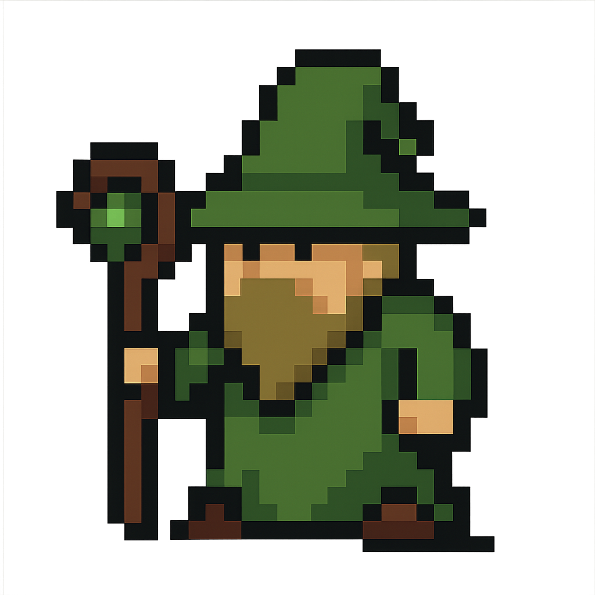
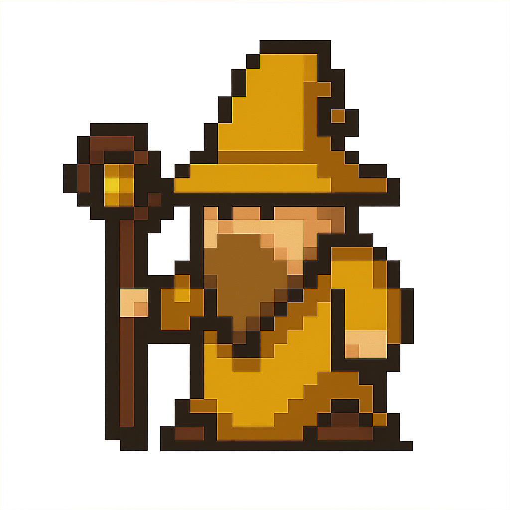

# 🎮 Colorbound 

  
  
  
  

**Colorbound** is a turn-based pixel-art strategy game built with Angular. You control a team of colorful characters with different classes and weapons, battling enemies on a grid-based battlefield using tactical movement and class advantages.

---

## 🧠 Game Concept

You create 3 player characters by choosing:
- 🎨 **Color**: (red, green, blue, yellow) — each strong or weak against another.
- 🧙 **Archetype**: mage, warrior, ranger, monk.
- 🗡️ **Weapon**: depends on archetype (e.g. fire, sword, bow, etc.).
- 🗡️ **Biome**: Biome together with the characters color change how much damage the character take.

The game auto-generates 3-5 enemy characters depending on how hard the player want's the game to be.

---

## 🎮 How to Play

- Click a player character to **select** them (tile is highlighted)
- Click another tile to **move**
- Each character has a `range` 
- Colors, archetypes and weapons have strengths/weaknesses

---

## ⚔️ Combat System 

### 🔄 Color Advantage (reduces incoming damage)
- Green > Yellow  
- Yellow > Blue  
- Blue > Red  
- Red > Green

### 🧱 Archetype Advantage (boosts damage)
- **Warrior > Ranger**
- **Ranger > Monk**
- **Monk > Mage**
- **Mage > Warrior**

### 🗡️ Weapon Advantage (per archetype)  (boosts damage)

#### Warrior:
- Sword > Hammer  
- Hammer > Axe  
- Axe > Spear  
- Spear > Sword

#### Mage:
- Fire > Earth  
- Earth > Lightning  
- Lightning > Water  
- Water > Fire

#### Ranger:
- Bow > Crossbow  
- Crossbow > Throwing Knife  
- Throwing Knife > Sling  
- Sling > Bow

#### Monk:
- Staff > Fists  
- Fists > Nunchaku  
- Nunchaku > Sai  
- Sai > Staff

### 🌍 Biomes  (reduces incoming damage)

Each board has a **biome** that benefits characters depending on their color:

| Biome             | Bonus For |
|-------------------|-----------|
| Lava Chamber      | Red       | 
| Abandoned Temple  | Green     |
| Crystal Cavern    | Blue      | 
| Desert Shrine     | Yellow    | 

### 🎯 Mechanics

- ✅ **Weapon advantage** boosts damage
- ✅ **Archetype advantage** boosts damage
- ✅ **Color advantage** reduces incoming damage
- ✅ **Biome match** reduces incoming damage

  
  
  
  

